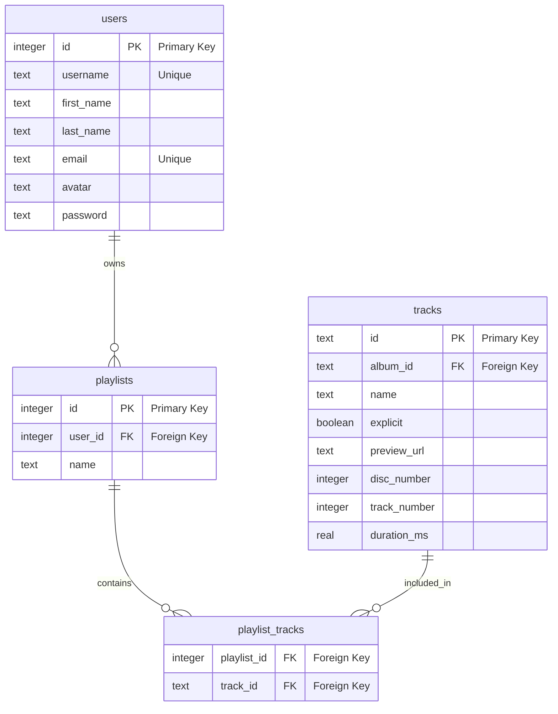

# Day 3 Workshop

There's an important feature we need to get off the ground: playlists.



## Migrations

Create migration files in the `db/migrations/` directory to build the tables
shown in the ER diagram above.

You'll need:
- `001_create_playlists.sql` - Creates the `playlists` table
- `002_create_playlist_tracks.sql` - Creates the junction table for the
  many-to-many relationship

> [!TIP]
>
> Refer to the
> [creating tables](https://tech-docs.corndel.com/sql/creating-tables.html)
> docs for `CREATE TABLE` syntax and foreign key constraints.

Run your migrations in order:

```bash
sqlite3 db/db.sqlite < db/migrations/001_create_playlists.sql
sqlite3 db/db.sqlite < db/migrations/002_create_playlist_tracks.sql
```

## Seed data

Create seed files in `db/seeds/` to populate your new tables with test data.
You'll need at least 3-5 playlists with multiple tracks in each.

> [!TIP]
>
> - Make sure `user_id` values reference existing users
> - You can find valid track IDs with: `sqlite3 db/db.sqlite "SELECT id FROM tracks LIMIT 20;"`
> - Seed playlists before playlist_tracks (order matters!)

Run your seeds after the migrations:

```bash
sqlite3 db/db.sqlite < db/seeds/playlists.sql
sqlite3 db/db.sqlite < db/seeds/playlist_tracks.sql
```

## Playlists page

Now that you've created the schema and seeded the data, let's create a UI to
display the playlists!

Create a new HTML page at `web/playlists.html` with a dropdown that shows all
available playlists. When a user selects a playlist from the dropdown, the page
should display all the tracks in that playlist.

To make this work, you'll need to:

1. Write a query to get all playlists and generate `reports/playlists.json`

   ```bash
   sqlite3 db/db.sqlite < queries/playlists.sql > reports/playlists.json
   ```

   > [!NOTE]
   >
   > Remember to put `.mode json` at the top of your `.sql` file to get `sqlite3`
   > to create JSON reports.

2. For each playlist, write a query that JOINs across the many-to-many
   relationship to get all tracks in that playlist. Generate JSON files like
   `reports/playlist-1.json`, `reports/playlist-2.json`, etc.

   > [!TIP]
   >
   > You'll need to JOIN three tables: `tracks`, `playlist_tracks`, and
   > potentially others depending on what information you want to display.

3. Create the HTML page with:
   - A dropdown (`<select>`) element populated from `playlists.json`
   - A container to display the tracks
   - JavaScript that fetches the appropriate `playlist-{id}.json` file when a
     playlist is selected

4. Add a link to your new playlists page in the navigation bar of the existing
   HTML pages

With Live Server running, you should now be able to select different playlists
and see their tracks displayed!

## Stretch challenges

Once you have the basic playlists page working, try extending it with some of
these features:

- Display the user information (username, name) for who created each playlist
- Show album artwork for each track in the playlist
- Calculate and display the total duration of the playlist
- Add the ability to order tracks by different criteria (name, duration, etc.)
- Show playlist statistics (number of tracks, total duration, most common
  artist)
- Create multiple playlists with different themes (e.g., "High Energy Workout",
  "Chill Acoustic", "90s Throwback") and seed them with appropriate tracks
